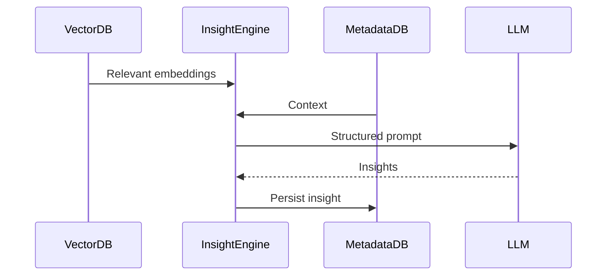
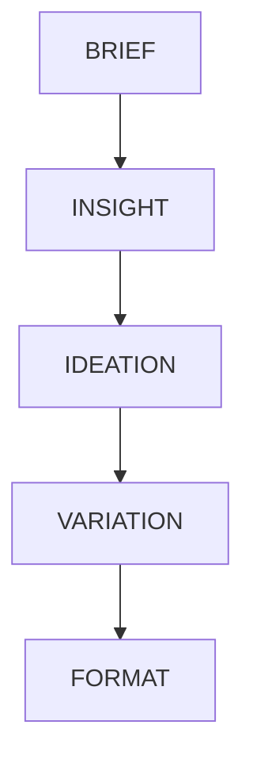

# Chalaang — Technical Product & Architecture Documentation
**Audience:** Engineering, Architecture, DevOps, AI/ML, Platform teams  
**Purpose:** Single source of truth for building, maintaining, and scaling the Chalaang platform  
**Tone:** Technical, implementation-focused, non-marketing  
**Version:** v1.0 (Foundational)

---

## 1. Product Overview (Engineering Context)

Chalaang is a **brand intelligence and creative generation system** designed to ingest brand-specific data, learn structured and unstructured patterns, and produce context-aware creative outputs across formats and platforms.

At a technical level, Chalaang is:

- A **multi-tenant AI system**
- With **per-brand memory and intelligence**
- Built on **LLM orchestration + vector search + structured metadata**
- Designed as a **compounding data flywheel**, not a stateless generator

The core engineering challenge is **persistent brand cognition**, not content generation.

---

## 2. Core Design Principles

1. **Brand Isolation**
   - Every brand has logically isolated data, embeddings, and intelligence
   - Cross-brand learning is abstracted and anonymized

2. **Stateless Execution, Stateful Intelligence**
   - APIs are stateless
   - Brand intelligence lives in long-term stores

3. **Composable Intelligence**
   - Insight extraction, ideation, generation, and scoring are modular services

4. **Model-Agnostic Architecture**
   - Gemini / OpenAI / OSS LLMs interchangeable
   - Prompt logic externalized

5. **Human-in-the-loop by Design**
   - Feedback is first-class data

---

## 3. High-Level System Architecture

```mermaid
graph TD
    UI[Web App / Dashboard]
    API[API Gateway]
    AUTH[Auth & RBAC]
    BRANDSVC[Brand Service]
    INGEST[Data Ingestion Service]
    EMBED[Embedding Service]
    VECTOR[Vector DB]
    META[Metadata DB]
    INSIGHT[Insight Engine]
    LLM[LLM Orchestrator]
    CREATIVE[Creative Generator]
    SCORE[Creative Scoring Engine]
    FEEDBACK[Feedback Service]
    ANALYTICS[Analytics Pipeline]

    UI --> API
    API --> AUTH
    API --> BRANDSVC
    BRANDSVC --> INGEST
    INGEST --> EMBED
    EMBED --> VECTOR
    INGEST --> META
    VECTOR --> INSIGHT
    META --> INSIGHT
    INSIGHT --> LLM
    LLM --> CREATIVE
    CREATIVE --> SCORE
    SCORE --> UI
    UI --> FEEDBACK
    FEEDBACK --> ANALYTICS
    ANALYTICS --> INSIGHT
````

---

## 4. Tenancy & Identity Model

### 4.1 Tenancy Levels

| Level        | Description                         |
| ------------ | ----------------------------------- |
| Organization | Parent entity (agency / enterprise) |
| Brand        | Primary intelligence boundary       |
| Workspace    | Optional grouping                   |
| User         | Individual identity                 |

### 4.2 Access Control

* JWT-based auth
* Role-Based Access Control (RBAC)
* Brand-scoped permissions

```json
{
  "user_id": "uuid",
  "org_id": "uuid",
  "brand_ids": ["uuid"],
  "role": "admin | editor | viewer"
}
```

## 5. Brand Brain (Core Concept)

The **Brand Brain** is a logical construct composed of:

1. Brand Memory
2. Brand Embeddings
3. Insight Graph
4. Performance Signals

It is **not a single model**, but a **composite intelligence layer**.

---

## 6. Data Ingestion Layer

### 6.1 Supported Inputs

| Type       | Examples                   |
| ---------- | -------------------------- |
| Text       | Brand books, briefs, copy  |
| Images     | Ads, creatives             |
| Video      | Reels, ads                 |
| URLs       | Websites, competitor pages |
| Structured | Calendars, metrics         |

### 6.2 Ingestion Pipeline


* **Clean:** OCR, HTML stripping, language detection
* **Chunk:** Semantic chunking (token-aware)
* **Classify:** Asset type, tone, intent
* **Store:** Metadata + embeddings

---

## 7. Embedding & Vector Strategy

### 7.1 Vector Types

| Vector Type         | Purpose                    |
| ------------------- | -------------------------- |
| Brand Voice         | Tone & linguistic patterns |
| Visual Style        | Image embeddings           |
| Strategic Insight   | Abstract concepts          |
| Performance Pattern | High-performing traits     |

### 7.2 Vector Namespace Isolation


vector_namespace = org_id:brand_id:vector_type

This prevents leakage and enables fast retrieval.

---

## 8. Metadata Schema (Core)

```json
{
  "asset_id": "uuid",
  "brand_id": "uuid",
  "type": "copy | image | video | insight",
  "source": "upload | generated | external",
  "tags": ["festive", "premium"],
  "tone": ["bold", "trustworthy"],
  "created_at": "ISO8601",
  "performance": {
    "ctr": 0.04,
    "engagement": 0.12
  }
}
```

---

## 9. Insight Engine

### 9.1 Purpose

Transforms **raw brand data** into **structured intelligence**.

### 9.2 Insight Types

* Tonal insights
* Strategic patterns
* Competitive gaps
* Content fatigue signals

### 9.3 Execution Flow



---

## 10. LLM Orchestration

### 10.1 Prompt Layers

1. **System Prompt** – Global constraints
2. **Brand Prompt** – Extracted brand DNA
3. **Task Prompt** – User intent
4. **Context Pack** – Retrieved embeddings

All prompts are versioned and stored.

---

## 11. Creative Generation Engine

### 11.1 Output Types

* Copy
* Static creatives
* Video scripts
* Content calendars
* Ad variants

### 11.2 Generation Pipeline



Each stage is a separate callable service.

---

## 12. Creative Scoring Engine

Scores outputs **before** human review.

### Signals Used:

* Brand alignment score
* Historical performance similarity
* Platform-specific heuristics
* Language quality metrics

```json
{
  "creative_id": "uuid",
  "brand_fit": 0.91,
  "predicted_engagement": 0.14
}
```

---

## 13. Feedback Loop (Critical)

### 13.1 Feedback Types

* Like / Dislike
* Edit distance
* Manual rating
* Deployment performance

### 13.2 Learning Path


Feedback is **never discarded**.

---

## 14. Analytics & Telemetry

### Collected Metrics

* Prompt success rate
* Brand drift
* Creative reuse
* Latency
* Cost per output

All analytics are **brand-scoped**.

---

## 15. API Design

### 15.1 Core Endpoints

```
POST /brands
POST /ingest
POST /generate
POST /score
POST /feedback
GET  /insights
```

### 15.2 Example Generate Request

```json
{
  "brand_id": "uuid",
  "brief": "Launch festive campaign",
  "format": "instagram_post"
}
```

---

## 16. Frontend Architecture

* React / Next.js
* Component-driven
* API-first
* No business logic on client

State is ephemeral; intelligence lives server-side.

---

## 17. Infrastructure & Deployment

### Stack

| Layer   | Tech                  |
| ------- | --------------------- |
| Backend | FastAPI               |
| Async   | Celery / PubSub       |
| DB      | PostgreSQL            |
| Vector  | Pinecone / Weaviate   |
| Cache   | Redis                 |
| Storage | Object Storage        |
| CI/CD   | GitHub Actions        |
| Hosting | Cloud VM / Kubernetes |

---

## 18. Security Considerations

* Brand data encryption at rest
* Namespace isolation
* Audit logs
* Prompt injection protection
* No cross-brand retrieval

---

## 19. Scaling Strategy

### Horizontal Scaling Targets

* Ingestion
* Generation
* Scoring

### Vertical Scaling Targets

* Insight Engine
* Vector queries

---

## 20. Development Guidelines

1. No hardcoded prompts
2. No shared vector namespaces
3. All intelligence must be explainable
4. Every output traceable to inputs
5. Feedback is mandatory data

---

## 21. Roadmap (Engineering)

### Phase 1

* Brand Brain v1
* Core ingestion
* Text + image generation

### Phase 2

* Performance intelligence
* Creative scoring
* API ecosystem

### Phase 3

* Marketplace
* Plugin SDK
* Cross-brand anonymized learning

---

## 22. Non-Goals

* Competing with ad platforms
* Replacing design tools
* Stateless generation tools

---

## 23. Summary (Engineering POV)

Chalaang is **not** a content generator.

It is:

* A persistent brand cognition system
* A learning intelligence platform
* A creative reasoning engine

Every architectural decision must reinforce:

> **Memory → Insight → Creation → Feedback → Memory**

This loop is the product.

---

**End of Document**


